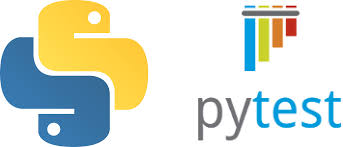

# Pytest

Welcome to the Pytest Automation Framework repository!<br>
This project provides a structured approach to writing and running automated tests using Pytest.<br>
It includes setup instructions, test execution commands, and configuration details to help you get started quickly.

### Key Features
- **Easy Setup**: Step-by-step instructions to install Python and necessary dependencies.
- **Test Execution**: Commands to run your tests with options for output capturing.
- **Global Fixtures**: Guidelines for creating reusable fixtures in `conftest.py`.
- **Configuration Files**: Information on using `pytest.ini` for configuring Pytest.

Follow the detailed steps in this README to set up and use the tools provided in this repository.

---

### Setup:
1. Install Python
2. `pip install pytest` + other dependencies (check: `pytest\environment.yml`)
3. `pytest tests/test_my_functions.py`

---

### Running tests:
By default, pytest captures all output to stdout and stderr.<br>
If you want to see print statements immediately during test execution, you can disable output capturing by using the -s option:

```Bash
pytest -s tests/test_classes.py
``` 
---
### Global fixtures:
In pytest, you can create global fixtures by defining them in a file called `conftest.py`. <br>
This file should be located in your project's root directory or in any directory containing tests. <br>
Pytest will automatically discover `conftest.py` files and the fixtures defined in them, and these fixtures will be available to all tests in your project.

---
### Config file:
The `pytest.ini`, `pyproject.toml`, and `setup.cfg` are configuration files that can be used by pytest. They are not the same, but they can serve a similar purpose.

The `pytest.ini` file is a file specifically for pytest configuration. 

The `setup.cfg` file is a more general configuration file that can be used by various Python tools, including pytest. 

The `pyproject.toml` file is a newer configuration file introduced in PEP 518 that can be used by various Python tools, including pytest.

You can put these files in the **root directory** of your project. When pytest runs, it will look in the root directory for these files to load configuration settings.

If you have multiple configuration files, pytest will use settings from all of them, with the following priority order:

1. `pytest.ini`
3. `pyproject.toml`
3. `setup.cfg`

So, if the same configuration setting is specified in multiple files, the setting from the file with the highest priority will be used.

---
### .env file
To work with `.env` files in Python, you can use the `python-dotenv` library.<br> 
This library allows you to specify environment variables in a `.env` file, which it can then load into your Python program.<br>

```Bash
pip install python-dotenv
```

Create a `.env` file in the `root` directory of your project. In this file, you can specify environment variables like this:

```
API_URL=https://example.com/api
API_KEY=your_api_key
```

In your Python program, use python-dotenv to load the environment variables from the .env file:

```
from dotenv import load_dotenv

load_dotenv()

# Now you can access the environment variables as if they were set in the actual environment:
import os

api_url = os.getenv('API_URL')
api_key = os.getenv('API_KEY')
```
---
### Filesystems

```Bash
pip install aiofiles
```
`aiofiles.open()` is used to read and write files asynchronously.<br>
This is similar to `fs.readFile()` and `fs.writeFile()` in JavaScript code.<br>
`os.remove()` is used to delete a file.<br>

---
### Hooks

Hooks are special functions that pytest will automatically call at certain points during the testing process.

`def pytest_sessionstart(session):` This function is a pytest hook that is automatically called once before any tests or test cases are run.

`def pytest_sessionfinish(session, exitstatus):` This function is another pytest hook that is automatically called once after all tests and test cases have finished running.<br> 
This might be done to clean up after the tests, or to ensure that the token isn't accidentally used outside of the testing session.

The `session` parameter in both `pytest_sessionstart` and `pytest_sessionfinish` is a Session object that contains information about the testing session,<br> 
such as the tests that are being run and their status.<br> 
The `exitstatus` parameter in `pytest_sessionfinish` is the exit status of the testing session, which can be used to determine if the tests passed or failed.

---

### Virtual Environments:

**Run the following command to create a virtual environment:**
```Bash
python -m venv pythonenv
```

**Activate the Virtual Environment:**
```Bash
pythonenv\Scripts\activate
```

**Install Packages:**
```Bash
pip install package_name
```

**Deactivate the Virtual Environment:**
```Bash
deactivate
```

**Export the installed packages to a requirements.txt file:**
```Bash
pip freeze > requirements.txt
```

**To list all virtual environments created using venv or other tools like virtualenv, you can use:**
```Bash
dir /s /b activate
```

---

### Virtual Environments in Anaconda:
Create a New Anaconda Environment:
```Bash
conda create --name pytestenv python=3.11
```
 To activate this environment, use:
```Bash
conda activate pytestenv
```
To deactivate an active environment, use
```Bash
conda deactivate
```
Example of the cmd:
```Bash
(pytestenv) C:\...\Desktop\github\pytest>
```

To effectively recreate the environment with the correct dependencies on another device, you would typically use an `environment.yml`.<br>
Here's how you can create an `environment.yml` file and use it to recreate the environment on another device:

1. **Export Your Environment:**
    - First, ensure your Conda environment (`pytestenv`) is activated.
    - Export your environment to an `environment.yml` file:

```Bash
conda env export > environment.yml
```
This file includes all the necessary information about the environment, including the name, channels from where packages are fetched, and the list of packages with their versions.

2. **Recreate the Environment on Another Device:**
    - Transfer the `environment.yml` file to the other device where you want to recreate the environment.
    - Use the following command to create an environment from the `environment.yml` file:

```Bash
conda env create -f environment.yml
```
This process ensures that you have an exact replica of your development environment on another device, including all dependencies with their correct versions.

---

### Importing modules:
**Ensure Proper Package Structure**: Make sure each directory in the path has an `__init__.py` file to be recognized as a Python package. 

**Import Functions**: With this structure, you can import functions from `my_module.py` into `test_my_module.py` using a relative import.

```plaintext
my_project/
│
├── my_package/
│   ├── __init__.py
│   └── my_module.py
│
└── tests/
    ├── __init__.py
    └── test_my_module.py
```
```Python
from .my_module import my_function
```
**A single dot (.)** means that the import is relative to the current package. It's used to import a module from the same directory as the current module.<br>
**Two dots (..)** indicate that the import should go up one directory level from the current package.<br>
**Three dots (...)** indicate that the import should go up two directory levels from the current package.<br>

---

### print():
To print the console output in a more readable JSON format, you can use the json module's dumps method with the indent parameter set to format the JSON data.

```Python
import json

print(json.dumps(images, indent=4))
```

---
### HTML reports:
For generating HTML reports in pytest, the most commonly recommended tool is pytest-html.<br> It is a plugin for pytest that generates a detailed HTML report for test sessions.<br> This report includes the summary of the test outcomes, categorization of tests (passed, failed, skipped, etc.),<br> and can also include additional information like logs, links, and screenshots if configured.

```Bash
pip install pytest-html
```

Run pytest with HTML report option: When running pytest, add the --html flag followed by the name of the report file you wish to generate.
This command will execute your tests and generate an HTML report named report.html in your current directory.

```Bash
pytest --html=report.html
```

1. **Custom Report Title**: to set a custom title for the HTML report.

```Bash
pytest --html=report.html --html-report-title="My Test Report"
```

2. **Append to Existing Report**: If you want to append the results to an existing report rather than overwrite it.

```Bash
pytest --html=report.html --self-contained-html=False
```

3. **Include Environment Section**: To include an environment section in the report, you can create an environment.properties file with key-value pairs and use the --metadata option to add each key-value pair.

```Bash
pytest --html=report.html --metadata Browser Firefox --metadata Environment Test
```

You can put many pytest configuration options, including those for pytest-html, into a configuration file so you don't need to enter them every time you run a script. The most commonly used configuration file for pytest is `pytest.ini`

```Python
[pytest]
addopts =
    --html=report.html
    --self-contained-html
    --metadata Browser Chrome
    --metadata Environment Test
```

This configuration will automatically apply the specified options every time you run pytest, generating an HTML report titled "My Test Report" with the additional metadata and custom CSS specified.

For options that cannot be directly included in the configuration file, like adding extra links or assets through markers or modifying the pytest metadata within a test, you'll need to handle those within your test files or through custom plugins or hooks.

Remember to place the pytest.ini file at the root of your project or in a location where pytest can automatically detect it.

---

### Logging
To include log output in the HTML report generated by pytest-html, you need to ensure that logging is properly configured in your pytest tests and that the log messages are captured by pytest.

1. Configure Logging in `conftest.py`

```Python
# conftest.py
import logging

def pytest_configure(config):
    # Basic logging configuration
    logging.basicConfig(level=logging.INFO, format='%(asctime)s [%(levelname)s] %(message)s', datefmt='%Y-%m-%d %H:%M:%S')
```

2. Use Logging in Your Test

```Python
import logging

def test_example():
    logging.info("This is an info log message.")
    assert True
```

3. Run pytest with Logging and HTML Report Options
`--log-cli-level=INFO` to capture log messages at the INFO level and above.

```Bash
pytest -s --log-cli-level=INFO api_integration_testing/module_c/tests/test_get_user.py --html=report.html
```

---

### Coverage report

When running tests in a Python project, it's crucial to understand not just if your tests pass or fail, but also how much of your code is actually being tested.

```Bash
pip install pytest-cov
```

```Bash
pytest tests/test_classes.py --html=report.html --cov --cov-report html
```

`--cov`: This option enables coverage reporting. It tells pytest to measure the code coverage of your tests, i.e., which parts of your source code are executed while the tests run.<br>
`--cov-report html`: This specifies the format of the coverage report. In this case, an HTML report which provides a visual and detailed overview of the coverage analysis.

---

### Parallel

pytest by itself does not support parallel test execution as a default feature.<br>
To run tests in parallel, you need to use additional plugins like pytest-xdist.<br> 
This plugin adds parallel testing capabilities to pytest,<br> 
allowing you to significantly reduce the time it takes to run your test suite by distributing tests across multiple CPUs or even separate machines.

```Bash
pip install pytest-xdist
```

Then, you can run your tests in parallel by adding the -n option followed by the number of CPU cores you want to use.<br> 
For example, to run tests on 4 cores, you would use:

```Bash
pytest -n 4
```

---

### GIT

**Sequentially:**

```yml
name: Run Module Tests

on:
  workflow_dispatch # Allow manual triggering of the workflow
  #[push] # Trigger the workflow on push events

jobs:
  test-modules:
    runs-on: ubuntu-latest
    steps:
    - uses: actions/checkout@v2
    - name: Set up Python
      uses: actions/setup-python@v2
      with:
        python-version: '3.8'
    - name: Install dependencies
      run: |
        python -m pip install --upgrade pip
        pip install pytest httpx pytest-html python-dotenv aiofiles jsonschema pytest-asyncio
    - name: Run Module D Tests
      run: pytest -s api_integration_testing/module_d/tests/ --html=report_module_d.html
    - name: Run Module C Tests
      run: pytest -s api_integration_testing/module_c/tests/ --html=report_module_c.html
    - name: Upload HTML reports
      uses: actions/upload-artifact@v2
      with:
        name: HTML-reports
        path: |
          report_module_d.html
          report_module_c.html
```

**Parallel:**

```yml
name: Run Module Tests

on:
  workflow_dispatch # Allow manual triggering of the workflow
  #[push] # Trigger the workflow on push events

jobs:
  test-modules:
    runs-on: ubuntu-latest
    strategy:
      matrix:
        module: [module_d, module_c]
    steps:
    - uses: actions/checkout@v2
    - name: Set up Python
      uses: actions/setup-python@v2
      with:
        python-version: '3.8'
    - name: Install dependencies
      run: |
        python -m pip install --upgrade pip
        pip install pytest httpx pytest-html python-dotenv aiofiles jsonschema pytest-asyncio
    - name: Run Tests
      run: pytest -s api_integration_testing/${{ matrix.module }}/tests/ --html=report_${{ matrix.module }}.html
    - name: Upload HTML report
      uses: actions/upload-artifact@v2
      with:
        name: HTML-report-${{ matrix.module }}
        path: report_${{ matrix.module }}.html
```

---

### Marks

Pytest marks allow you to categorize your tests, making it easier to manage and execute subsets of your test suite based on certain criteria.

`@pytest.mark.slow`:

**Purpose**: This mark is used to label tests that are slow to execute. You can use this mark to exclude or specifically include slow tests during test runs, optimizing your development workflow.<br>
**Example Usage**: Running only fast tests by excluding the slow ones with a command like `pytest -k "not slow"`.

`@pytest.mark.xfail`:

**Purpose**: Marks a test that is expected to fail. This is useful when a known bug is present, and the test will pass once the bug is fixed.<br>
**Example Usage**: Allows the test suite to pass in a CI/CD pipeline despite the presence of a known failing test, without hiding the test failure.<br>
**Attributes**: reason="This test is expected to fail due to bug #123" provides a reason for the expected failure.

`@pytest.mark.skip`:

**Purpose**: Skips the execution of the marked test function. This is useful for tests that are not applicable under certain conditions or if a feature is not yet implemented.<br>
**Example Usage**: Temporarily disabling a test that relies on a feature not yet available in the development environment.<br>
**Attributes**: reason="This test is skipped because feature #456 is not yet implemented" explains why the test is skipped.

`@pytest.mark.custom_mark`:

**Purpose**: Demonstrates how to create a custom mark. Custom marks can be used to categorize tests in any way that suits your project's needs.<br>
**Example Usage**: Running a specific subset of tests tagged with a custom mark, like `pytest -m custom_mark`.<br>
**Attributes**: reason="This is a custom mark with a message" provides additional context for the custom mark.

`@pytest.mark.parametrize`:

**Purpose**: Allows one to define multiple sets of arguments and expected results for a test function. Pytest will run the test function once for each set of arguments.<br>
**Example Usage**: Testing a function with various inputs to ensure it behaves as expected in different scenarios.<br>
**Attributes**: The parameters num, expected followed by a list of tuples, each representing a test case with an input (num) and the expected output (expected).